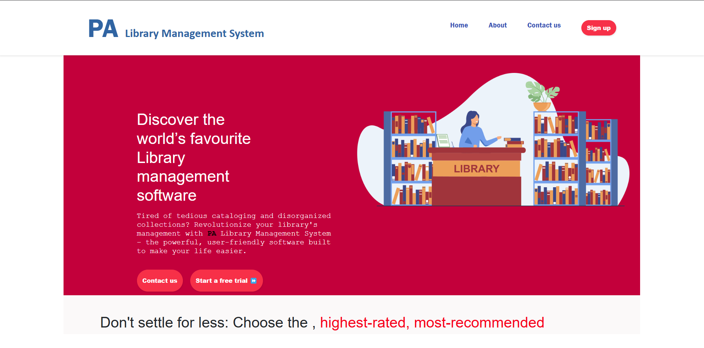
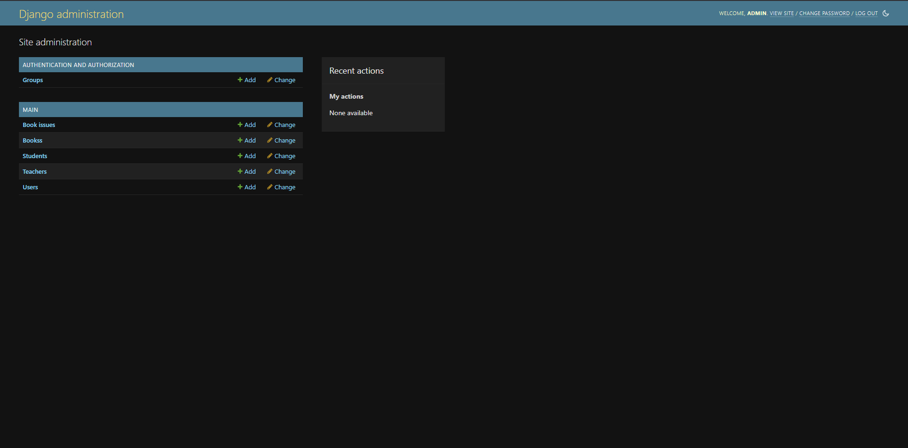

### 📚 Library Management System  

#### 📝 Overview  
The **Library Management System** is a Django-based web application that allows users to register, sign in, and manage books efficiently. It includes features such as user authentication, book tracking, and an intuitive UI for managing books.  

---

## 🚀 Features  
- 📌 **User Authentication**: Signup, login, and session management.  
- 📚 **Book Management**: Add, delete, and track books taken by users.  
- 📅 **Admin Dashboard**: Admin panel to manage users and books.  
- 🎨 **Responsive UI**: Styled with CSS to provide a seamless experience.  

---

## 🛠️ Tech Stack  
- **Backend**: Django (Python)  
- **Database**: SQLite / PostgreSQL  
- **Frontend**: HTML, CSS, JavaScript  
- **Hosting**: AWS / Heroku (Optional)  

---

## 🐂 Project Structure  
```
library_management/
│
├── accessfile/              # Static files  
│   ├── book/                # Book-related assets  
│   │   └── book.css  
│   ├── main/                # Main UI styling  
│   │   └── index.css  
│   └── signup/              # Signup page assets  
│       ├── sign.css  
│       └── sign.js  
│
├── library_management/       # Main Django project  
│   ├── settings.py           # Django settings  
│   ├── urls.py               # URL routing  
│   ├── wsgi.py               # Deployment WSGI  
│   └── asgi.py               # ASGI config  
│
├── main/                     # App module  
│   ├── models.py             # Database models  
│   ├── views.py              # Business logic  
│   ├── urls.py               # App URL routing  
│   ├── admin.py              # Admin panel setup  
│   ├── templates/            # HTML templates  
│   │   ├── Index.html        # Home Page  
│   │   ├── book_list.html    # Book List Page  
│   │   └── signup.html       # Signup Page  
│   ├── migrations/           # Database migrations  
│
├── manage.py                 # Django project manager  
├── requirements.txt          # Project dependencies  
```

---

## 🔧 Installation Guide  

1️⃣ **Clone the repository**  
```bash
git clone https://github.com/Yogesh-MG/LibraryManagementSystem.git
cd LibraryManagementSystem 
```

2️⃣ **Create a virtual environment & activate it**  
```bash
python -m venv venv  
source venv/bin/activate  # macOS/Linux  
venv\Scripts\activate  # Windows  
```

3️⃣ **Install dependencies**  
```bash
pip install -r requirements.txt
```

4️⃣ **Run database migrations and Collect static files**  
```bash
python manage.py migrate
python manage.py collectstatic
```

5️⃣ **Run the development server**  
```bash
python manage.py runserver
```

6️⃣ **Access the app**  
Open your browser and go to:  
🔗 `http://127.0.0.1:8000/`

---

## 🖼️ Screenshots  



---

## 🤝 Contributing  
Contributions are welcome! Fork the repo, create a new branch, and submit a PR.  

---

## 📝 License  
This project is **MIT Licensed**.  

---
